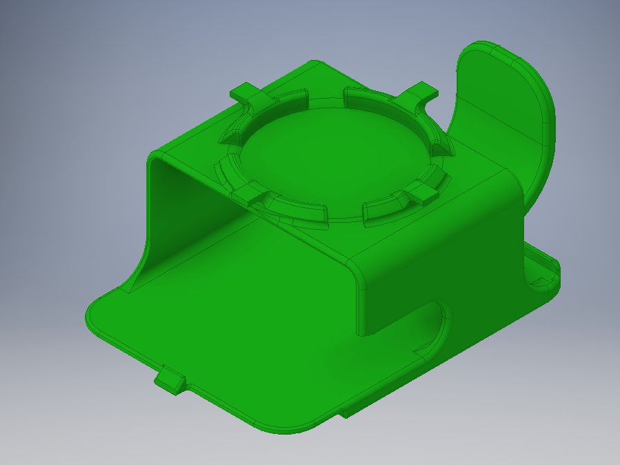
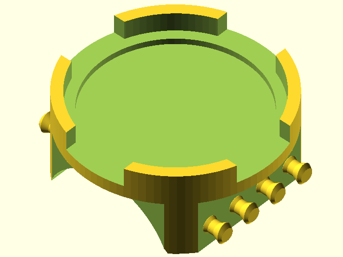

# GPS-holder

This repository contains CAD source files for two 3d printed devices I designed to secure a GPS unit and it's antenna (puck) a ship. There are two parts, the casing for the GPS body and the bracket to hold the puck.

|  |
| :--------------------------------------------------------------: |
|                The casing and puck holder, in use                |

## GPS Casing

|  |
| :----------------------------------------------: |
|           CAD render of the GPS casing           |

This snap-fit casing protects the GPS's main body and includes magnets embedded so that it can be magnetically attached to the wall of the ship. The top section includes a metal washer that allows the GPS puck to be magnetically mounted and "fingers" that allow the cable to be wrapped around them.

Autodesk Inventor part file here: [casing.ipt](casing.ipt)

## Puck Holder

|  |
| :---------------------------------------------------: |
|             CAD render of the puck holder             |

This bracket attaches via magnets and a strap to a rail on the ship and provides a flat surface for the GPS puck to be attached. The top section includes a metal washer that allows the GPS puck to be magnetically mounted.

OpenSCAD source file here: [puck_holder.scad](puck_holder.scad)
