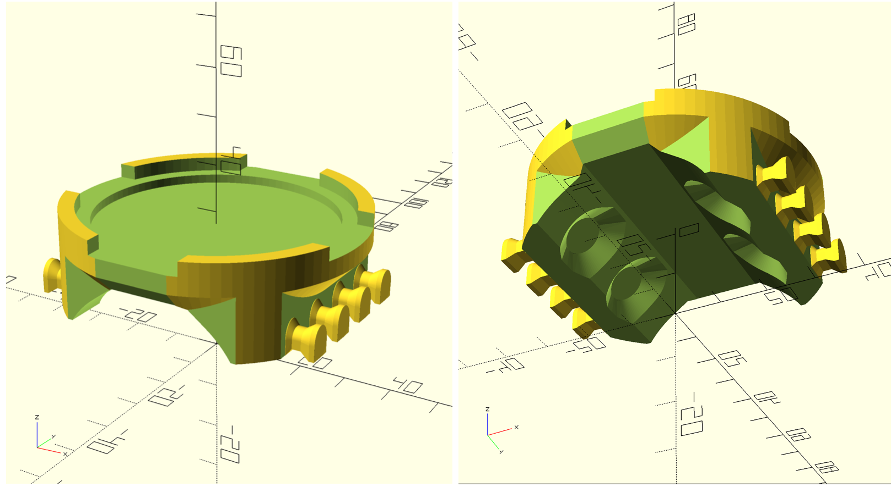

# GPS-holder

## GPS Casing

This snap-fit casing protects the GPS's main body and includes magnets embedded so that it can be magnetically attached to the wall of the ship. The top section includes a metal washer that allows the GPS puck to be magnetically mounted and "fingers" that allow the cable to be wrapped around them.

## Puck Holder

This bracket attaches via magnets and a strap to a rail on the ship and provides a flat surface for the GPS puck to be attached. The top section includes a metal washer that allows the GPS puck to be magnetically mounted.